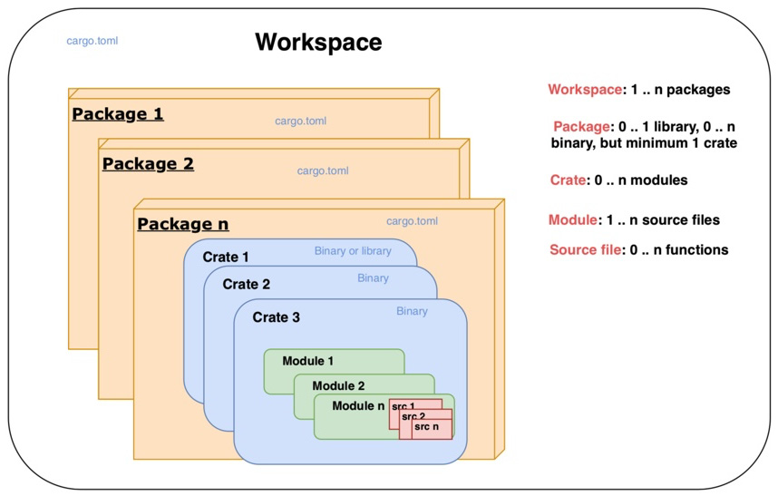

## Chapter1

### rustup

```shell
$ rustup toolchain install nightly # 安装nightly Rust
$ rustup default nightly # 全局级别启用nightly Rust
$ rustup override set nightly # 目录级别启用nighly Rust
$ rustup run nightly rustc --version # 获取nightly Rust 版本
$ rustup default stable # 使用Rust stable 版本
$ rustup show # 显示当前使用当Rust版本
$ rustup update # 更新最新的Rust的版本
```

### Cargo

```yaml
[package]
name = "demo"
version = "0.1.0"
authors = ["tianqian.zyf"]
edition = "2018"

# See more keys and their definitions at https://doc.rust-lang.org/cargo/reference/manifest.html

[[bin]]
name = "chapter3"
path = "src/bin/chapter3.rs"

[[bin]]
name = "chapter4"
path = "src/bin/chapter3.rs"

[[lib]]

[[example]]

# 集成测试target，在tests目录，每一个test target都可以编译成一个二进制
[[test]]
name = "integration"
path = "tests/lib.rs"

# benchmark target，每一个target都可以独立编译成二进制
[[bench]]


[dependencies]
regex = "1.3.9"
# 
# chrono = { git = "https://github.com/chronotope/chrono" ,branch = "master" }
# cratename = { version = "2.1", registry = "alternate-registry-name" }
#
#

# 给examples、tests、benchmarks等提供相关依赖
[dev-dependencies]

# 给build scripts提供相关依赖
[build-dependencies]


# 跨平台编译相关的target
[target]

# 四种类型的profiles，可以分配
[profile.dev]
[profile.release]
# cargo test 使用这个profile
[profile.test]
# cargo bench 使用这个profile
[profile.bench]
# 指定workspace，确定那个package是workspace，哪些是子package
[workspace]

```



一个Project包含一个Workspace(Workspace本身包含一个cargo.toml)、一个Workspace包含多个Package(每一个Package包含一个cargo.toml)、每一个Package可以是一个libray，或者是多个binary，
但是无论如何至少会包含一个Crate、一个 Crate会包含多个modules、每一个Module则会包含多个文件，每一个文件会包含多个function等。


```shell
$ cargo build
$ cargo run
$ cargo run --bin xxx # 指定某个bin target文件执行
$ rustc --print sysroot # 打印LD_LIBRARY_PATH
$ cargo test --test integration # 仅仅运行integration target test
$ cargo test --test integration -- --test-threads=1 # 单线程运行集成测试
$ cargo build --release/dev # 指定profile编译
$ cargo check # 检查语法错误
$ cargo test --no-run # 编译但是不运行test
$ cargo test —- --ignored # 运行被忽略的test
```

## Documentation


代码注释:

* `//` 单行注释
* `/* */` 多行注释

文档注释:

* `///` 可以使用markdown，属于item级别的文档
* `//!` crate级别的注释

```shell
$ cargo doc -open # 生成文档注释对应的HTML文档
$ rustdoc doc/itest.md # 将独立的markdown文件，生成HTML文档
$ cargo test --doc # 运行文档中的example代码
```


## Chapter2

* `std::any::Any`

This can be used when the type of the value passed to a function is not known at compile time. Runtime reflection is used to check the type and perform suitable processing.

```rust
use std::fmt::Debug;
use std::any::Any;

fn log<T: Any + Debug>(value: &T) {
    let value_any = value as &dyn Any;
    match value_any.downcast_ref::<String>() {
        Some(as_string) => {
            println!("String ({}): {}", as_string.len(), as_string);
        }
        None => {
            println!("{:?}", value)
        }
    }
}

fn do_work<T: Any + Debug>(value: &T) {
    log(value);
    // ... do some other work
}

fn main() {
    let my_string = "Hello World".to_string();
    do_work(&my_string);

    let my_i8: i8 = 100;
    do_work(&my_i8);
}
```

* `pin`


* `ptr`

1. `*const i32`
2. `*mut i32`